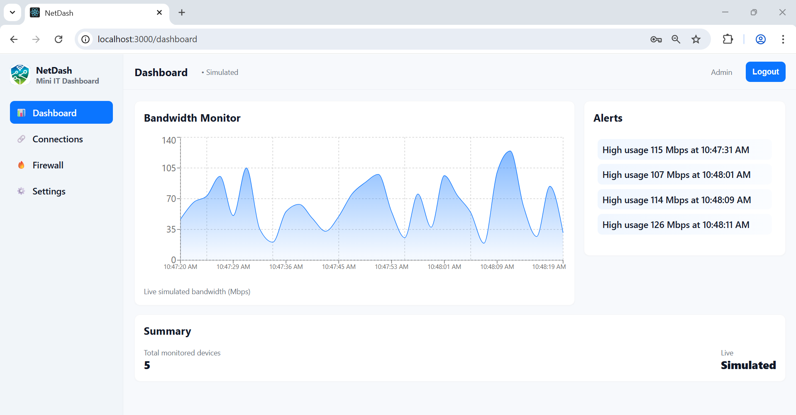
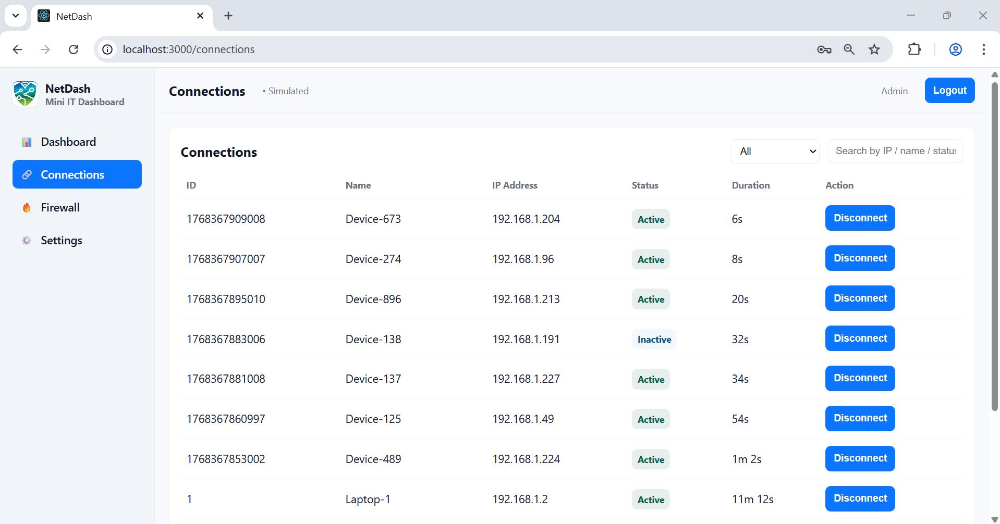
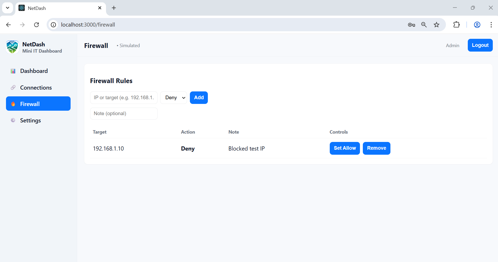
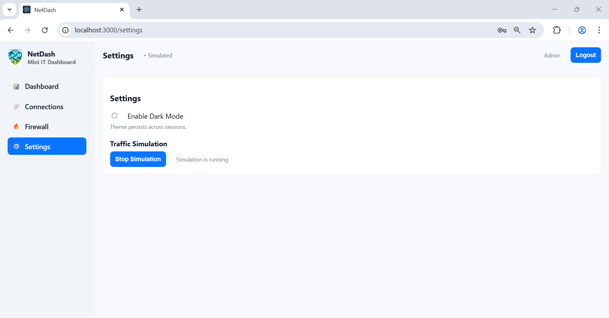

# NetDash – Mini IT Networking Dashboard


## Overview
**NetDash** is a **simulated IT networking dashboard** built with **React**, **CSS**, and **React Router**.  
It provides a modern, responsive UI to monitor bandwidth, connected devices, firewall rules, and basic settings.  
The project is designed for **learning purposes**, simulating real-time networking features without actual backend connections.

---

## Features

- **Authentication**
  - Login required to access dashboard, connections, firewall, and settings pages.
  - Protected routes ensure only authenticated users can view sensitive content.

- **Dashboard**
  - Real-time **bandwidth monitor** with live line/area chart.
  - Alerts panel displaying high bandwidth usage.
  - Summary section showing **total monitored devices** and **simulation status**.

- **Connections**
  - Table of connected devices (ID, IP, status, duration).
  - Search and filter functionality for easy navigation.

- **Firewall**
  - List of firewall rules with **Allow/Deny toggles**.
  - Add or remove rules dynamically.

- **Settings**
  - **Light/Dark mode toggle**.
  - **Start/Stop traffic simulation** control.

- **Sidebar Navigation**
  - Clean sidebar with **icons** for Dashboard, Connections, Firewall, and Settings.
  - Custom logo displayed at the top.

- **Responsive UI**
  - Works on desktop and mobile screens.
  - Styled purely with CSS.

- **Simulated Real-Time Updates**
  - Bandwidth and connections update live using React state and hooks.

---

## Tech Stack

- **React.js** (Functional Components + Hooks)
- **React Router** (Navigation + Protected Routes)
- **CSS** (Custom styling, responsive layout)
- **Chart.js / Recharts** (Real-time charts)
- **Context API** (Global simulation state)

---

## Folder Structure
```
netdash/
│
├── src/
│ ├── assets/ # Logo & images
│ ├── components/ # Sidebar, Navbar, Charts, Tables
│ ├── contexts/ # Simulation state context
│ ├── pages/ # Dashboard, Connections, Firewall, Settings, Login
│ ├── App.js
│ ├── index.js
│ └── styles.css
│
├── package.json
└── README.md
```


---

## Screenshots

### Login


### Dashboard


### Connections


### Firewall


### Settings


---

Usage
1. Login with any username and password (simulated).
2. Navigate through Dashboard, Connections, Firewall, and Settings using the sidebar.
3. Monitor simulated bandwidth and device connections in real-time.
4. Toggle firewall rules or simulation mode in Settings.

Future Improvements
- Integrate real backend with actual network monitoring.
- Add user roles for admin and regular users.
- Add notifications for critical bandwidth usage.
- Improve charts with historical data and export options.


Done by Dhanush B K
